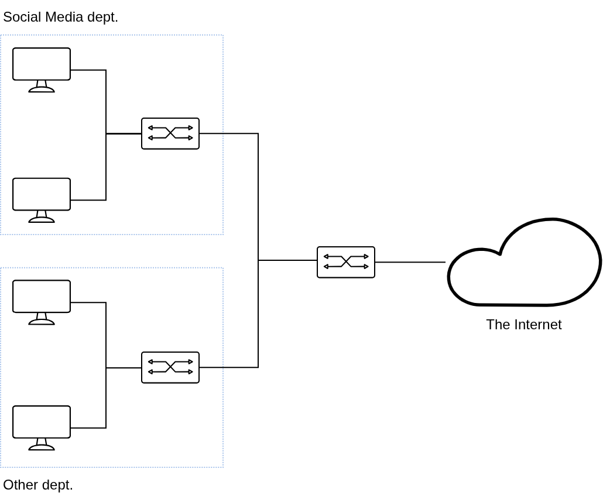

Why SNACK?
===========

Background
------------

Consider an office environment with its network topology shown in Figure 1.

*Figure 1. Oversimplified office network topology*

In a corporate office environment, productivity of its workers are highly valued. As such employers constantly seek methods of improving the overall efficiency and productivity of its employees. However, employees, being human, are susceptible to distractions that would reduce their overall productivity. This particular organisation employs many young people (Gen Z's) to work in their office, who have a predisposition to accessing social media on a regular basis, affecting their performance during work hours. Corporate cannot sanction the IT department to block all access to social media services as there exists a Social Media department of this organisation that requires constant access to those services in order to do their job. They also cannot apply a permanent block on social media access to users outside the Social Media department, as it may be considered infringing upon the rights of employees and a form of discrimination.

Here comes SNACK
------------------

We propose a time-based solution of limiting access and usage of social media services to achieve a balance between productivity and information access.
The employee will still be able to access social media services for a certain duration, before access is temporarily cut off, indicating the need to return to work. In this context, accessing social media can be considered as snacking rather than slacking (e.g. the employee peruses social media while on break).

As such, these were the origins for the name SNACK: Social Network Access Connection Kontroller. Indicated by the acronym, we aim to kontrol the connection to the social media services that are accessed by the employee. 

Why use SNACK?
------------------

The advantages in using SNACK for the employer are:
- The employees in the Social Media department will have unlimited access to social media services
- The employees in other department will have time-limited access to social media services
  - They can access a service for an hour, before getting blocked for another hour
  - The blocking will be done per service (e.g. blocked from accessing X/Twitter does not mean blocked from
    accessing Facebook) which can be useful to see how addicted the employee in accessing the social media
- Access to productivity services are not affected

Thanks to SNACK, the employer have their employee less slacking, and the employee still have their 'snack'
which is accessing social media services.  
Happy employer, ~~(hopefully)~~ happy employee.

- - -

Icons used in the topology are provided by [JGraph/draw.io](https://jgraph.github.io/drawio/) (Citrix icon pack)
