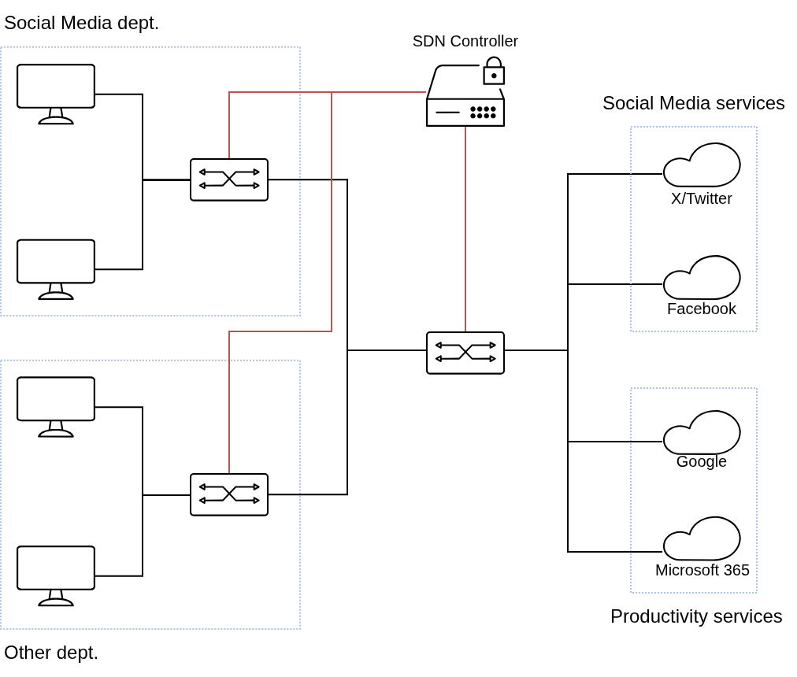
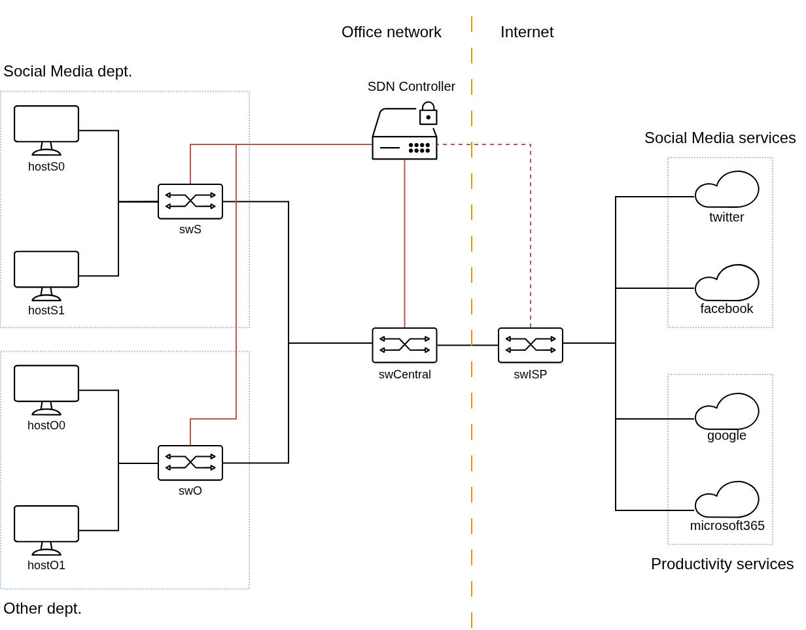

Behind SNACK
================

SNACK employs SDN switches, where the controller is powered by [Ryu](https://ryu-sdn.org/).  
Consider the office topology in Figure 1, with the internet represented by 4 cloud services.

*Figure 1. Office network topology*

Each department has their own switches which connect all the hosts inside the department, and connect them
with the central switch. The central switch acts as a gateway for the office network to access the Internet
and as the access limiter to the social media services. All switches are connected to the SDN controller.

When a user intends to access a particular social media service (sending a packet to the IP address of the service), if it does not know the address for that particular social media service, its packet will be sent to the controller (as per default flow rules). Upon 

TODO: Explain the hard-timeouts

TODO: Flow table

Simulating the network
-------------------------

The network simulated using [Mininet](https://mininet.org).  
Figure 2 shows the simulation topology with the nodes' name.

*Figure 2. Simulation scenario*

Cloud services are represented by mininet hosts. `swISP` exists to simulate the gateway from the ISP
to the Internet. The simulation only employs one controller, so the `swISP` is also connected to the controller
(realistically, it is not, however for the sake of this simulation and programming the gateway, it is).

The node details are shown in tables below:

### Social Media dept.

Hosts

| Host name | IP       |
|-----------|----------|
| `hostS0`  | 10.1.1.1 |
| `hostS1`  | 10.1.1.2 |

`swS`  
Description: Switch in the Social Media Department  
DPID: `00:00:00:00:01:00:01`

| Port number | Connected to |
| ----------- | ------------ |
| 1 | `hostS0` |
| 2 | `hostS1` |
| 3 | `swCentral` |

### Other dept.

Hosts

| Host name | IP       |
|-----------|----------|
| `hostO0`  | 10.1.2.1 |
| `hostO1`  | 10.1.2.2 |

`swO`  
Description: Switch in another department  
DPID: `00:00:00:00:01:00:02`

| Port number | Connected to |
| ----------- |--------------|
| 1 | `hostO0`     |
| 2 | `hostO1`     |
| 3 | `swCentral`  |

### Office Gateway/Central

`swCentral`  
Description: Central switch. Gateway to the Internet  
DPID: `00:00:00:00:01:01:01`

| Port number | Connected to |
| ----------- |--------------|
| 1 | `swS`        |
| 2 | `swO`        |
| 3 | `swISP`      |

### The Internet

Hosts

| Host name      | IP       |
|----------------|----------|
| `twitter`      | 10.2.1.1 |
| `facebook`     | 10.2.2.1 |
| `google`       | 10.2.3.1 |
| `microsoft365` | 10.2.4.1 |

`swISP`  
Description: Switch in the Internet Service Provider (ISP)  
DPID: `00:00:00:00:02:00:01`

| Port number | Connected to   |
| ----------- |----------------|
| 1 | `swCentral`    |
| 2 | `twitter`      |
| 3 | `facebook`     |
| 3 | `google`       |
| 3 | `microsoft365` |

Flow table
-----------

There are 2 types of rules: proactive rules and reactive rules.  
Proactive rules contains the default rule for a switch to work. Basic forwarding done as a proactive rules.  
Reactive rules contains the rule that added in certain event. In this case, it used for time-limiting the access

The larger the priority number, the highest the priority.

TODO: Explain the hard-timeouts

TODO: Sequence diagram for pushing proactive rules

TODO: Sequence diagram for pushing reactive rules

TODO: Explain the proactive rules and how to push them

TODO: Explain the reactive rules and how to push them

- - -

Icons used in the topology are provided by [JGraph/draw.io](https://jgraph.github.io/drawio/) (Citrix icon pack)
